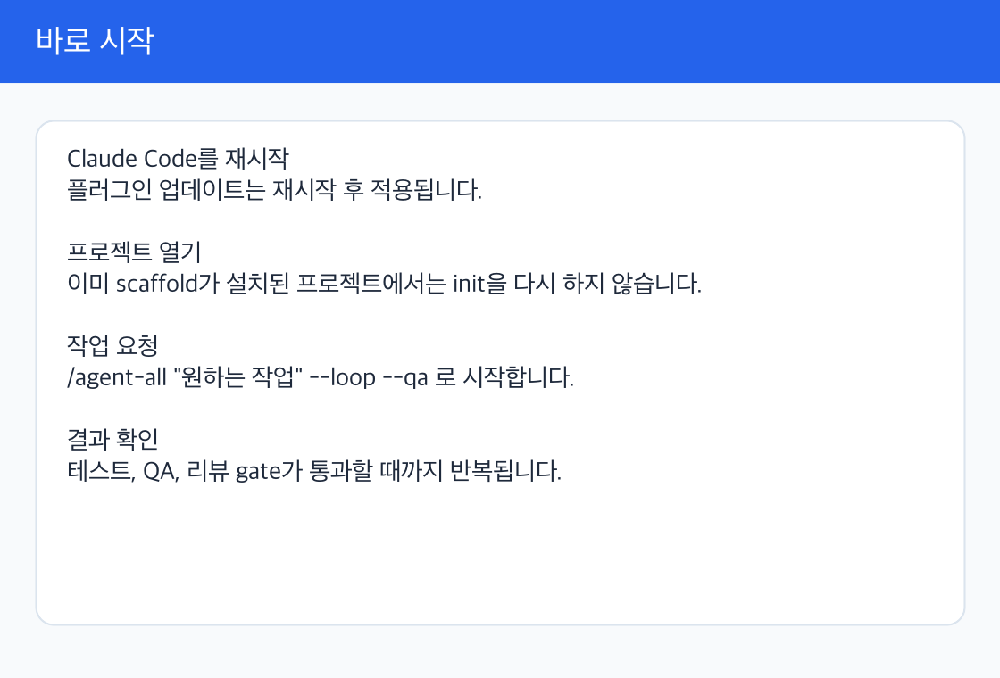

> 🇰🇷 한국어: [README.ko.md](README.ko.md)

# agent-skill

   -blueviolet) 

**Agent-first workflows that run themselves.** One `/agent-init` per project; one `/agent-all "..." --loop --qa` per feature; the agent brainstorms → plans → writes → tests → **visually QAs every page** → opens the PR — and keeps iterating until tests AND the UI both pass — without you babysitting every turn.

Works on Claude Code today, with cross-platform ports for **Cursor, GitHub Copilot CLI, VS Code Copilot, Codex CLI, and Gemini CLI**. 19 plugins, 7 slash commands, one marketplace.

```
/agent-init                                  # bootstrap any git repo (Phase A — once per project)
/agent-all "Add Google OAuth" --loop --qa    # tests + visual-qa until both pass, opens PR (Phase C)
/agent-handoff .agent-skill/tasks/T-20260611-001-oauth.md  # write handoff + new-session resume prompt
/visual-qa                                   # screenshot every page, LLM design review (declared or comprehensive)
/thrift                                      # keep long sessions affordable (auto-summarize, audit)
/explore                                     # codebase map; /explore where Foo → O(1) lookup
/debug "tests flaky 30% of runs"             # reproduce → bisect → hypothesize → verify
```

**Three things that make it click:**

1. **Project-first scaffolding.** `/agent-init` works on any git repo — Next.js, FastAPI, Rust CLI, monorepo. It detects your stack, picks the right test command, and creates `CLAUDE.md` + `AGENTS.md` + agents + hooks + config in one commit. Same command, every project.

2. **Agent-first execution that preserves your main thread.** `/agent-all "..."` isn't a chat. It runs brainstorm → plan → implement → review → PR as **one pipeline**, and the implementation/review heavy lifting happens in **isolated subagents** — their turn-by-turn output never enters your main conversation. A built-in two-layer safety net mandates `superpowers:verification-before-completion` per implementer + cross-checks at Phase 4 review, so broken code can't sneak into a PR. Your main session stays small (planning + judgment) so the same Claude Code session can keep going for hours without context bloat.

3. **One-flag end-to-end verification.** `--qa` wires the loop's "done" check to **tests + visual UI check**: visual-qa crawls every page, DOM-walks every interactive element, shallow-clicks each button, screenshots every state, diffs vs baseline — and only breaks the loop when both tests and the UI verdict pass. Compose with `/thrift` + `/goal` for unattended overnight runs. See [Self-sustaining workflows](#self-sustaining-workflows).

That's it. The rest of this README is reference material — skim the parts you need.

New installer? Start with the [Platform Quickstart](docs/quickstart/README.md)
to choose Claude, Codex, Copilot, Cursor, Gemini, or VS Code Copilot and verify
the host-level install before running `/agent-init` or the matching
project-local bootstrap.

For positioning against adjacent harnesses such as Gajae-Code and OMO, and for
the general harness-building pattern this repo demonstrates, see
[docs/HARNESS_POSITIONING.md](docs/HARNESS_POSITIONING.md). The short version:
`agent-skill` is not trying to be another standalone runtime. It is a
project-local harness generator that installs the same operating method across
Claude, Codex, Copilot, Cursor, Gemini, and VS Code Copilot with explicit
verification, policy, doctor, and release gates.

---

## Start Here

The detailed image-backed user manual is [docs/USER_MANUAL.md](docs/USER_MANUAL.md). It walks through global plugin install versus per-project `/agent-init`, when init is needed again, good `/agent-all` request examples, automatic `/thrift` recommendations, and the real support level for each platform.



Short version:

- **Claude Code plugin install is machine/user scope.** Restart Claude Code or run `/reload-plugins` after installing or updating.
- **`/agent-init` is project scope.** New git repos need it once; projects that already have the scaffold do not need init again after a plugin update.
- **Daily work starts with `/agent-all "..." --loop --qa`.** Use `--qa` by default for UI work.
- When sessions get long and large output repeats, the context-mode router recommends `/thrift`.

---

## Prerequisites

- **Node.js ≥ 20** — required for all install renderers (`bin/init.mjs`, `bin/install.mjs`, `scripts/install-all.sh`, `scripts/install-platform.sh`)
- **git** — required by `/agent-init`, `/agent-all`, and `/explore` (HEAD-keyed cache)
- **gh CLI** (optional) — for `/agent-all` Phase 5 PR creation; without it, `/agent-all` falls back to `--no-pr` mode
- **For Claude Code**: marketplace plugin support (any recent build)
- **For per-platform project renderers**: writable target project directory. Target CLIs are only needed when you run the generated workflows; `install-platform.sh` does not patch global CLI config files.

Strongly recommended (the harness composes on top of these — degrades gracefully if missing):

- `superpowers@claude-plugins-official` — foundational skills (brainstorming, writing-plans, subagent-driven-development, verification-before-completion, etc.)
- `context-mode@context-mode` — keeps raw tool output out of main conversation

See [How this fits with the rest of the Claude ecosystem](#how-this-fits-with-the-rest-of-the-claude-ecosystem) for details on how they integrate.

---

## Install in 60 seconds

First, register the marketplace (once per machine):

```
/plugin marketplace add https://github.com/kim-song-jun/agent-skill
```

### Option A: one-liner (recommended)

```bash
# Outside Claude Code, in a terminal:
git clone https://github.com/kim-song-jun/agent-skill /tmp/agent-skill
bash /tmp/agent-skill/scripts/install-all.sh --foundations
```

Installs all 6 Claude Code essentials plus the approved foundations (`superpowers@claude-plugins-official`, `context-mode@context-mode`) at once via the `claude` CLI. Run `--all` for all 19 plugins (CLI-platform siblings too), `--cli=codex|copilot|gemini|cursor` for a single platform set, or `--foundations-only` to bootstrap just the foundations. Add `--dry-run` to print the exact plan without calling `claude`.

### Option B: paste into Claude Code

```
/plugin install harness-builder@agent-skill
/plugin install harness-floor@agent-skill
/plugin install harness-thrift@agent-skill
/plugin install harness-explore@agent-skill
/plugin install harness-debug@agent-skill
/plugin install harness-data@agent-skill
/reload-plugins
```

(Claude Code's `/plugin install` accepts only one plugin at a time, so the script in Option A is faster.)

### Then in your project

```
cd my-project
/agent-init
```

`/agent-init` finishes by running the post-install doctor. Re-run it any time:

```bash
node /path/to/harness-builder/bin/doctor.mjs --target=. --platform=claude
```

From a source checkout, use `node /tmp/agent-skill/scripts/doctor.mjs ...` as the compatibility wrapper.

You're done. Try `/agent-all "small feature"` to see it work.

---

## Keep plugins up to date

**In Claude Code:**
```
/plugin update --marketplace agent-skill
```

That single command updates everything **already installed** from this marketplace.

**From your terminal (any platform, one-liner):**
```bash
bash <(curl -fsSL https://raw.githubusercontent.com/kim-song-jun/agent-skill/main/scripts/update.sh)
```

`scripts/update.sh` self-locates the repo (or clones into a temp dir), pulls latest, verifies vendored libs (`sync-lib.mjs --check`), force-updates already-installed selected plugins by uninstalling/reinstalling them, then re-runs `install-all.sh` for anything missing. Pass `--all` for all 19 plugins or `--cli=cursor|copilot|codex|gemini` for one platform set. It does not patch global CLI config files.

Use `scripts/update.sh --foundations` when you also want to refresh the approved foundation plugins: `superpowers@claude-plugins-official` and `context-mode@context-mode`. Use `scripts/update.sh --foundations-only` to update/install only the approved foundation plugins without touching agent-skill plugin selections.

For other CLIs without a marketplace, see [Updating on other tools](#updating-on-other-tools).

### Install newly added plugins

Important: `/plugin update` only updates plugins you've already installed. The marketplace can grow over time (for example, `harness-debug-codex` was added after the first Claude-native debug release). To pick those up:

```
/plugin marketplace update agent-skill        # refresh the listing
/plugin install harness-thrift@agent-skill    # install each new plugin you want
/plugin install harness-explore@agent-skill
/plugin install harness-debug@agent-skill
/plugin install harness-data@agent-skill
/plugin install harness-debug-codex@agent-skill
/reload-plugins                               # apply
```

**Quick check** — see what you currently have installed from this marketplace:

```bash
cat ~/.claude/plugins/installed_plugins.json | python3 -m json.tool | grep -B1 agent-skill
```

If the count is below 6 (the recommended Claude Code set: builder + floor + thrift + explore + debug + data) you're missing the recent additions.

---

## What each command does

### `/agent-init` — set up the project

Run once per project. Operational mode creates task ledger files, local folder guides, Claude/Codex policy hooks, stack-specific implementer personas, and reviewer personas. Existing `CLAUDE.md`, `AGENTS.md`, and `GEMINI.md` are updated by an `agent-skill:operational` sentinel section instead of overwritten.

```
/agent-init                       # default: operational/heavy scaffold
/agent-init --lite                # minimal root memory + minimal roles
/agent-init --lang=ko             # persist Korean prompts into CLAUDE.md + .agent-all.json language
/agent-init --lang=auto           # resolve language from AGENT_INIT_LANG/locale, then persist ko/en
/agent-init --dry-run             # print planned files and config patches
/agent-init --update-foundations  # update approved foundation plugins only
```

### `/agent-all` — ship a feature

Takes a free-form prompt OR an existing task file. Plans → writes code → tests → opens a PR.
During dispatch, it classifies changed files and failure state to pick the
right roles dynamically: frontend work pulls in design/QA, data lifecycle
changes pull in data review, security-sensitive changes pull in security
review, and repeated failure signatures escalate to planner/user decision.

```
/agent-all "Add Google OAuth"                        # prompt → PR
/agent-all .agent-skill/tasks/T-20260611-001-oauth.md # use a written task
/agent-all "fix flaky test" --loop --max-iter=5      # keep trying till tests pass
/agent-all "..." --no-pr                             # local-only (no PR)
```

By default it is bounded by `--max-iter`, `--max-cost` (default $500), and any
configured `--max-runtime-sec`; completion is driven by the break condition in
`.agent-all.json`. Use `--max-iter=0` or `loop.maxIter: null` for unlimited
iteration count; cost/runtime budgets, hard policy hooks, user interruption,
and repeated failure signatures still stop the loop.

### `/agent-handoff` — resume a long task cleanly

Generates `.agent-skill/handoff/<display-id>-<slug>.handoff.md` and
`.agent-skill/handoff/<display-id>-<slug>.session.md` from an in-progress task
doc, safe git state, and `.agent-all-state.json`. New task docs use
`T-YYYYMMDD-NNN` display ids in filenames and carry a stable `AS-TASK-*`
canonical id in frontmatter/metadata so parallel runs do not collide. The files
include human-readable status plus machine-readable metadata so
`/agent-all <task> --resume` can surface the recommended next action.

```
/agent-handoff .agent-skill/tasks/T-20260611-001-fix-flaky-test.md
/agent-handoff .agent-skill/tasks/T-20260611-001-fix-flaky-test.md --dry-run
/agent-handoff .agent-skill/tasks/T-20260611-001-fix-flaky-test.md --strict
/agent-all .agent-skill/tasks/T-20260611-001-fix-flaky-test.md --resume
```

Dangerous operations such as `git reset`, reseed commands, `--apply`, and
`docker volume rm` are never run during handoff generation; the session prompt
marks them as requiring explicit user approval. In non-TTY mode, the
recommended resume action is auto-selected and logged to
`.agent-skill/runs/handoff-audit.jsonl` and
`.agent-skill/runs/handoff/interactions.jsonl`.

### Artifact Policy

Generated control-plane artifacts default to `.agent-skill/`: task docs under
`.agent-skill/tasks/`, specs under `.agent-skill/specs/`, plans under
`.agent-skill/plans/`, handoff files under `.agent-skill/handoff/`, task
registry records in `.agent-skill/registry/tasks.json`, run logs under
`.agent-skill/runs/`, visual QA reports under
`.agent-skill/reports/visual-qa/`, debug logs under
`.agent-skill/reports/debug/`, and thrift audits under
`.agent-skill/reports/thrift/`; baselines live under
`.agent-skill/baselines/`. Existing `docs/tasks/` task docs are still readable
for resume/migration; `/agent-init` does not delete user docs.

Override the root in `.agent-all.json` with
`"artifact": {"root": ".custom-agent", "exportDocs": false}`. Set
`exportDocs: true` only when a workflow intentionally mirrors selected reports
into `docs/` for publication; runtime control-plane files stay out of `docs/`
by default.

### `/visual-qa` — design review every page

Captures screenshots at mobile/tablet/desktop, runs LLM analysis per image, writes a Markdown report AND a self-contained `report.html` lightbox viewer (v0.4+). Needs Playwright MCP + a dev server.

**v0.4 additions:**
- **Before/after pairs** per tracked element + baseline diff alongside.
- **`comprehensive.targets`** — element-scope `includeSelectors` / `excludeSelectors` / `actionsPerElement` to constrain or augment auto-discovery.
- **Multi-tier element identity** (`data-vqa-id` → semantic fingerprint → DOM path) so baseline matching survives wrapper / reorder refactors.

See `docs/superpowers/specs/2026-05-22-visual-qa-pairs-and-element-scope-design.md`.

Two modes (set via `.visual-qa.json` `mode` field):

- **`declared`** (default, back-compat): you list pages + selectors + states yourself.
- **`comprehensive`**: auto-discover everything. Crawls from `baseUrl`, walks each page's DOM for every interactive element (button, link, input, `[data-testid]`, `[role=*]`), shallow-clicks each non-input to capture the 1-step result state. Verdict is computed vs the prior accepted run; cost stays bounded by git-diff scoping + a DOM-hash cache. This is what `/agent-all --loop --qa` invokes per iter.

```
npm run dev                     # in another terminal
/visual-qa                      # captures + analyzes
/visual-qa --slug="launch"      # custom output folder
/visual-qa --budget=20          # cap LLM cost at $20
```

Output lands in `.agent-skill/reports/visual-qa/<date-or-slug>/report.md` (+ `verdict.json` in comprehensive mode).

### `/thrift` — keep long sessions cheap

For sessions over an hour. Auto-suggests `ctx_execute` for big tool outputs, summarizes the conversation at thresholds, audits cost at session end.

```
/thrift              # one-time setup
/thrift summarise    # manual summary trigger
/thrift audit        # cost report
```

Audit reports write to `.agent-skill/reports/thrift/audit-<date>.md` by default.
Edit `.thrift.json` to tune turn/token thresholds. Cache priming is **off by default** — sessions under 15 min don't benefit.

### `/explore` — fast codebase navigation

Builds a structured map of your project (~2 minutes for 100K lines), caches it per git commit, lets you query without re-grepping.

```
/explore                              # build/refresh the map
/explore where AuthService            # cached lookup
/explore deps src/auth/jwt.ts         # imports + reverse-imports
```

### `/debug` — methodical debugging

Step-by-step workflow with persistent state so you don't lose context across long debugging sessions.

```
/debug "auth flow test fails 30% of runs"
/debug --resume                       # pick up where you left off
/debug --bisect <good-sha> <bad-sha>  # git bisect wrapper
```

Parses 10 error formats (Python tracebacks, JS stack traces, pytest/jest/rust/tsc/gcc/ESLint output, etc.) into clickable citations.

---

## Common workflows

**Ship a UI feature end-to-end (the killer flow):**
```
npm run dev            # in another terminal — dev server at http://localhost:3000
/agent-all "Build user dashboard with charts + filters" --loop --qa --max-iter=10
# walk away — loop only breaks when tests AND visual-qa both pass
```

**Start a new project, ship a feature:**
```
mkdir my-app && cd my-app && git init && git commit --allow-empty -m "init"
/agent-init
/agent-all "Build a CLI to convert Markdown to PDF"
```

**Onboard to an unfamiliar codebase:**
```
git clone <repo> && cd <repo>
/agent-init --lite
/explore
/explore where MainController
```

**Fix a flaky test:**
```
/debug "tests/integration/checkout.test.ts is flaky"
# Walks you through: reproduce → bisect → hypothesize → verify
```

**Pre-launch checklist:**
```
/agent-all "Polish landing page, add analytics events" --loop
/visual-qa --slug="pre-launch"     # design review
/thrift audit                       # how much did this session cost?
```

**Long debugging marathon (keep cost down):**
```
/thrift                  # set up cost optimization first
/debug "..."             # then debug — thrift's hooks fire automatically
```

---

## Pick a theme

Themes bundle plugins for a specific kind of work:

| Theme | Command | What it gives you |
|---|---|---|
| **Builder** (A) | `/agent-init` | Project scaffolding. Run once. |
| **Floor** (C) | `/agent-all`, `/visual-qa` | Ship features. Cost-unrestricted. |
| **Thrift** (B) | `/thrift` | Cost optimization for long sessions. |
| **Explore** (D) | `/explore` | Codebase mapping & queries. |
| **Debug** (E) | `/debug` | Systematic debugging. |

Themes compose freely. A typical session uses Builder once, then Floor for the actual work, with Thrift quietly running in the background.

---

## Self-sustaining workflows

### Why this works — main-thread isolation

`/agent-all`'s real trick isn't the loop. It's **where the work happens.**

| Phase | Where it runs | What enters main context |
|---|---|---|
| 0 Preflight | main | git checks (~tiny) |
| 1 Intent (brainstorm) | main | Q&A with you (moderate accumulation) |
| 2 Plan | main | the plan file (moderate) |
| **3 Dispatch (3a/3b/3c)** | **fresh subagents (3a/3c parallel) + main (3b sequential ask)** | scoping payloads (~few-hundred tokens per task) + user-selected answers — implementer's code-writing stays isolated |
| **4 Gate** | **fresh subagents** | only spec/quality verdicts + reviewer-audit token — reviewer's reading stays isolated |
| 5 PR | main | `gh pr create` output (small) |
| 6 Loop | main | breakCondition exit code (one number) |

Heavy lifting (reading code, writing patches, running tests, fixing failures) happens **inside subagents** dispatched via `superpowers:subagent-driven-development`. Each subagent is a fresh conversation; their turn-by-turn output never enters your main session. Main sees only the verdict — so a loop iteration adds maybe 2–5K tokens, not 50K.

### Decision-surfacing — when subagents pause for input

Phase 3 now runs as **3a (scoping) → 3b (ask) → 3c (implement)**. Each implementer subagent first does a read-only scoping pass and returns architectural / spec-ambiguity decisions as a structured JSON payload. The coordinator normalizes each one to the common `agent-interaction/v1` schema, then renders it as a native `AskUserQuestion` panel on Claude or a prompt/markdown surface on Codex, Copilot, Cursor, and Gemini. The subagent is then re-dispatched with the answers baked in.

In **non-TTY mode** (overnight loops, `--yes`, iteration ≥ 2), recommended low/medium-risk options are auto-picked and logged to `.agent-all-state.json`, `.agent-skill/runs/<run-id>/decisions.md`, and `.agent-skill/runs/<run-id>/interactions.jsonl`. High-risk options are blocked instead of auto-approved. `/agent-handoff` and `/agent-all --resume` use the same interaction model for the resume prompt.

Enforced via `floor-policy` hooks backed by the shared Node policy engine
(`agent-policy-event/v1` -> `agent-policy-result/v1`). The engine validates
`verification_passed`, reviewer audit tokens, loop runaway/cost/repeated
failure stops, dangerous shell commands, pathspec commits, dynamic spawn
metadata, verification adapter lifecycle events, non-TTY decision logging, and
secret/privacy redaction for control-plane artifacts. Handoff/session prompts,
verification evidence,
visual/debug/thrift reports, policy/interaction/spawn logs, and PR bodies are scanned
before they are stored or shared; high-severity findings block by default,
medium findings are masked. Results append to
`.agent-skill/runs/<run-id>/policy-log.jsonl`; dynamic spawns also append
role, reason, wave, and cost estimate to
`.agent-skill/runs/<run-id>/spawn-log.jsonl`; user/resume decisions append to
`.agent-skill/runs/<run-id>/interactions.jsonl`; redaction summaries append to
`.agent-skill/runs/<run-id>/redaction-audit.jsonl` with rule/count metadata
only. Opt out or allow by path/rule per project in `.agent-all.json`:

```json
{
  "policy": { "decisionSurfacing": false, "verification": true, "reviewerAudit": true },
  "security": { "redaction": { "allowPaths": ["docs/public-fixtures/**"], "allowRules": [] } }
}
```

See `docs/superpowers/specs/2026-05-21-decision-surfacing-and-policy-hooks-design.md`
and `docs/superpowers/specs/2026-06-11-policy-hook-engine.md`; dynamic routing
is captured in `docs/superpowers/specs/2026-06-11-dynamic-agent-orchestration.md`.

### The composable trio

For overnight runs you want three things working together:

| Piece | Solves | Knows about |
|---|---|---|
| **`/agent-all --loop`** | Drive the workflow to verified completion within cost bounds | Phases, plan, dispatched agents, what was tried, accumulated cost, where it failed |
| **`/thrift`** | Compress what *does* accumulate in main before it bloats the session | Token-count thresholds, cache priming, end-of-session audit |
| **`/goal`** | Keep Claude Code from ending the session between iterations | Nothing about your work — pure Stop-event blocker |

```
/thrift                                                 # cost guardrails (once per project)
/goal "ship the analytics dashboard with all CI green"  # session keeps itself alive
/agent-all "Build analytics dashboard" --loop --qa \
  --max-iter=15 --max-cost=80
# walk away — wake up to a merged PR or a precise "stopped at iter 7 because <reason>"
```

### Loop completion — what counts as "done"

The loop re-enters Phase 1 after each PR until a **break-condition** passes. Pick one of:

| You want | What to do | What runs each iter |
|---|---|---|
| Just tests | `--loop` (then pick "Test command" on first prompt) | `npm test` / `pytest` / `cargo test` — stack-detected |
| Full E2E (tests + visual UI check) | `--loop --qa` ← **the shortcut** | tests → visual-qa comprehensive |
| CLI/API/data/SQL completion | `--break-condition='{"type":"verification-adapter",...}'` | adapter evidence → `.agent-skill/runs/<run-id>/verification-evidence.jsonl` |
| Custom command | `--break-condition='make ci'` | your one-liner |
| Anything explicit | `--break-condition='{"type":"composite","steps":[...]}'` | JSON spec |

On the **first** `/agent-all --loop` in a project, Phase 0 prompts interactively (test / visual-qa / verification adapter / custom / composite) and offers to save the choice to `.agent-all.json`. Subsequent runs reuse the saved value. `--reconfigure` forces a re-prompt; `--yes` / non-TTY skip it.

Verification adapters generalize the old web-only completion check without removing `/visual-qa`:

```bash
/agent-all "harden CLI output" --loop \
  --break-condition='{"type":"verification-adapter","adapter":"cli","config":{"command":"my-tool --help","goldenStdoutPath":"test/golden/help.txt"}}'

/agent-all "validate API schema" --loop \
  --break-condition='{"type":"verification-adapter","adapter":"api-contract","config":{"spec":"openapi.json","smokeCommand":"npm run smoke:api"}}'

/agent-all "refresh notebook output" --loop \
  --break-condition='{"type":"verification-adapter","adapter":"notebook-data","config":{"notebooks":["analysis.ipynb"],"requiredArtifacts":["outputs/summary.csv"],"seed":"42"}}'

/agent-all "validate warehouse query" --loop \
  --break-condition='{"type":"verification-adapter","adapter":"sql-db","config":{"files":["queries/validate.sql"],"command":"npm run validate:sql","assertions":[{"id":"row-count","type":"row-count","expected":10}],"requiredArtifacts":["reports/explain.txt"]}}'
```

Available adapters are `verify:web-ui` (the visual-qa wrapper), `verify:cli`, `verify:api-contract`, `verify:notebook-data`, `verify:sql-db`, and `verify:batch-job`. Every adapter returns `verification-evidence/v1` with `adapter`, `status`, optional `command`, `artifacts`, `summary`, `failures`, and reproducibility metadata.

For data work, install `harness-data` and use `/data-runner` to shape the task doc before `/agent-all`. The task template includes a Data Task Addendum for Dataset / Source, Data Snapshot, Assumptions, Reproducibility, Validation Queries, Artifacts, Data Risks, and Rollback / Cleanup. Destructive SQL/data operations are blocked by default; only set `allowDestructive=true` after explicit user approval.

### `--qa` end-to-end: prerequisites and step-by-step

`/agent-all "build user dashboard" --loop --qa --max-iter=10`

**Prerequisites** (the most common cause of "it didn't work"):

- A **dev server** running at `http://localhost:3000` (or whatever you put in `.visual-qa.json`'s `baseUrl`). Phase 0 probes it with `curl --max-time 3`; if unreachable, you get a clear prompt before anything else runs.
- **Playwright MCP** installed (the `mcp__plugin_playwright_playwright__*` tools must be available). `/visual-qa --skip-health` for a sanity check.

**What `--qa` actually does**:

1. **Phase 0**: probes `baseUrl`. If missing, asks before continuing. If `.visual-qa.json` doesn't exist, scaffolds it with sane defaults (mode=comprehensive, scope `/`, maxPages 50, depth 3, click 1-level, vs-baseline verdict, **firstRun=report** so iter 1 surfaces issues instead of silently locking them in as baseline).
2. **Phase 1-5**: agent-all's normal pipeline — brainstorm → plan → wave-dispatched implement → wave-reviewed → PR.
3. **Phase 6 (loop)**: runs `test-auto` (stack-detected test command) first. If tests fail → next iter. If tests pass → dispatches a fresh Task-tool subagent to invoke the `visual-qa` skill with `--slug=loop-iter-<N> --force --yes` (per-iter slug keeps iters from clobbering each other; Phase 2 of visual-qa still finds the previous iter as baseline).
4. visual-qa runs its own 6-phase pipeline: crawl from `baseUrl`, DOM-walk each page for interactive elements, shallow-click each button/link, screenshot every state, LLM-analyse each shot, compute verdict vs baseline. Exit 0 if no new critical/major regressions; exit 1 otherwise.
5. Phase 6 sees the verdict. Pass → loop breaks (you're done). Fail → next iter starts with the previous failure visible in the plan.

**Cost controls** (so loop iterations don't drown you):

- **git-diff scope**: only pages whose source code changed since the last iter get re-crawled (framework auto-detect for Next.js / Remix; conservative "rebuild everything" fallback)
- **DOM-hash cache**: components whose DOM hasn't changed reuse the prior LLM verdict instead of re-analysing
- **`--max-iter`** safety cap (or `0` for unlimited) + **`--max-cost=USD`** and **`--max-runtime-sec=seconds`** budget stops
- **Cost telemetry**: records `agent-cost-telemetry/v1` summaries in `.agent-skill/runs/<run-id>/cost-telemetry.jsonl`, mirrors the latest total to `state.costTelemetry.summary`, asks at 80% of budget, and stops at 100%. Reported platform cost wins; token/char estimates are best-effort and tunable under `.agent-all.json: telemetry.cost`.

### `/agent-all --loop` flag reference

| Flag | Default | Effect |
|---|---|---|
| `--loop` | off | Enable Phase 6 re-entry. First use prompts for break-condition. |
| `--max-iter=N` | config | Optional iteration safety cap; `0` means unlimited |
| `--max-cost=USD` | 500 | Cap on accumulated API cost; checked after each wave |
| `--max-runtime-sec=seconds` | config | Optional wall-clock cap for long loop runs |
| `--qa` | — | Shortcut: composite `test-auto → visual-qa(comprehensive)` + autoscaffold. See above. |
| `--break-condition=<spec>` | — | Non-interactive override. JSON object or shell string. |
| `--reconfigure` | — | Force re-prompt even when `.agent-all.json` has a non-default value. |
| `.agent-all.json: loop.maxIter` | `defaults.maxIter` | Set to `null` for unlimited iteration count |
| `.agent-all.json: loop.maxRepeatedFailureSignature` | 3 | Escalate to planner/user decision after the same failure repeats |
| `.agent-all.json: breakCondition` | `npm test` (auto-detected) | Persisted spec. String = shell; object = `shell` / `test-auto` / `visual-qa` / `verification-adapter` / `composite`. |
| `.agent-all.json: stableIters` | 1 | Consecutive passes required before loop breaks clean. |
| `.agent-all.json: telemetry.cost.warnAtRatio` | 0.8 | Budget warning threshold before a hard stop |
| `.agent-all.json: telemetry.cost.modelRates` | `{}` | Optional project-owned token rate overrides for estimates |

### Troubleshooting — common loop / `--qa` failures

| Symptom | Likely cause | Fix |
|---|---|---|
| Loop exits immediately with `exit=1` from visual-qa | dev server not running on `baseUrl` | `npm run dev` (or equivalent) in another terminal, then re-run with `--resume` |
| visual-qa aborts with "playwright MCP not available" | Playwright MCP not installed | `claude mcp add plugin-playwright` (or your platform's equivalent) |
| Loop runs but **never** breaks | `stableIters > 1` and one of N consecutive runs is failing intermittently | check `.agent-all-state.json` `consecutivePass`; lower `stableIters` to 1 if your test suite is flaky |
| visual-qa hits `--max-cost` on iter 2 | DOM-hash cache cold + git-diff scoper had nothing to filter on | iter 2+ are usually cheaper; if not, set `comprehensive.cache.gitDiffScope: true` (default) and confirm autoscaffold framework detection |
| iter 1 "passes" but UI is clearly broken | first-run policy is `report` (default) — loop passes but issues are reported. Read `.agent-skill/reports/visual-qa/loop-iter-1/report.md` | Fix the issues, then iter 2 will hold the bar against the iter-1 baseline |
| `--qa` writes a config but I want different settings | `--qa` autoscaffold runs only when `.visual-qa.json` is missing | Edit `.visual-qa.json` (change scope, breakpoints, baseUrl, etc.) — subsequent runs use the file as-is |

### How this is different from `/goal` and Ralph Loop

`/agent-all --loop` is **not** "Ralph Loop plus features" — it's an orchestrator that happens to loop. The differences matter:

| Tool | What it solves | What it knows about |
|---|---|---|
| **`/goal`** | "Don't let the session stop until X." | Nothing about your work. Pure Stop-event blocker. |
| **Ralph Loop** | "Re-run this prompt every N minutes." | Nothing between runs. Stateless re-fire. |
| **`/agent-all --loop`** | "Drive a complete workflow (brainstorm → plan → code → review → PR) to verified completion within cost bounds." | Phases, plan, dispatched agents, what was tried, cost, where it failed. |

What the harness adds that neither has: multi-phase workflow awareness, **stateful retries** (each iter sees the previous failure), **wave-granularity cost caps** (`--max-cost` checked after each wave so it can bail mid-feature), **resume-from-failure** via `.agent-all-state.json`, and **phase-aware break-conditions** (evaluated after PR creation, not mid-implementation).

`/goal` and Ralph are **complements**, not alternatives. `/goal` + `/agent-all --loop` is the unattended-overnight pattern shown above. Ralph wrapping a non-`--loop` `/agent-all` makes sense only for wall-clock periodicity (e.g. `/ralph-loop 5m /agent-all "check deploy"`).

---

## Stack examples

### Next.js + TypeScript

```bash
npx create-next-app@latest my-app --typescript
cd my-app && git init && git add -A && git commit -m "init"
```
```
/agent-init                                # detects TS, sets breakCondition: npm test
/agent-all "Add Google OAuth with profile upload"
/visual-qa --slug="oauth"
```

### Python FastAPI

```bash
mkdir api && cd api && touch pyproject.toml main.py
git init && git add -A && git commit -m "init"
```
```
/agent-init --size=small
# Open .agent-all.json, change "breakCondition" to "pytest"
/agent-all "JWT auth middleware" --loop --max-iter=5
```

### Rust CLI (no visual-qa needed)

```bash
cargo new mycli && cd mycli && git init && git add -A && git commit -m "init"
```
```
/agent-init --lite                         # detects Cargo.toml → "cargo test"
/agent-all "Add git-style subcommands" --loop --max-cost=25
```

---

## Use it from Claude Code or other AI tools

Claude Code has a native marketplace (`/plugin install`), and `/agent-init` remains the primary in-Claude setup path. Codex CLI 0.140.0+ also has a native plugin manager (`codex plugin marketplace` + `codex plugin add`) for the Codex plugin bundle. For terminal-driven project bootstrap, `install-platform.sh --platform=claude|codex` runs the same project-local renderers outside the chat surface. Cursor, GitHub Copilot, Gemini CLI, and VS Code Copilot still don't have a comparable plugin marketplace for this workflow, so the wrapper writes the right files into your project. CLI platforms receive their config, hook, and skill files in that tool's expected layout; VS Code Copilot receives editor instructions only.

### One-command install per platform

```bash
git clone https://github.com/kim-song-jun/agent-skill /tmp/agent-skill
cd /tmp/agent-skill

# Claude Code project bootstrap outside Claude Code
./scripts/install-platform.sh --platform=claude --target=/path/to/my-project
./scripts/install-platform.sh --platform=claude --target=/path/to/my-project --theme=builder
./scripts/install-platform.sh --platform=claude --target=/path/to/my-project --lite

# Cursor
./scripts/install-platform.sh --platform=cursor --target=/path/to/my-project

# GitHub Copilot CLI
./scripts/install-platform.sh --platform=copilot --target=/path/to/my-project

# VS Code with Copilot extension (instructions-only)
./scripts/install-platform.sh --platform=vscode-copilot --target=/path/to/my-project  # instructions-only

# OpenAI Codex CLI plugin install/update, user scope
./scripts/update-codex-plugins.sh

# OpenAI Codex CLI project bootstrap
./scripts/install-platform.sh --platform=codex --target=/path/to/my-project
./scripts/install-platform.sh --platform=codex --target=/path/to/my-project --lang=ko
./scripts/install-platform.sh --platform=codex --target=/path/to/my-project --no-update-foundations
./scripts/install-platform.sh --platform=codex --target=/path/to/my-project --update-foundations  # strict foundation refresh
./scripts/install-platform.sh --platform=codex --target=/path/to/my-project --theme=debug

# OpenAI Codex CLI, lightweight builder-only scaffold
./scripts/install-platform.sh --platform=codex --target=/path/to/my-project --lite

# Google Gemini CLI / antigravity
./scripts/install-platform.sh --platform=gemini --target=/path/to/my-project
```

Default installs the operational scaffold. Non-Claude platforms install their available heavy themes by default: builder + floor + thrift everywhere, plus debug for Codex. Use `--theme=floor`, `--theme=thrift`, or Codex-only `--theme=debug` to install just one. Claude project bootstrap supports the default floor-enabled operational scaffold, `--theme=builder` for the heavy builder scaffold without `.visual-qa.json` or `.agent-all.json`, and `--lite`; install Claude slash-command plugins through `install-all.sh` or `/plugin install`. Use `--lite` for a builder-only lightweight scaffold; for Codex this passes through to `/agent-init --lite` and skips floor/thrift/debug files plus global config snippets. VS Code Copilot is instructions-only and does not accept floor/thrift/debug theme installs. Use `--lang=ko|en|auto` to keep generated root guidance aligned and, when floor config is installed, keep `.agent-all.json` language aligned too. For Claude/Codex operational installs, `install-platform.sh` auto-updates only the approved foundation plugins (`superpowers@claude-plugins-official`, `context-mode@context-mode`) when possible; if the `claude` CLI is missing or the approved foundation update fails, the scaffold continues with a degraded foundation warning. Lite installs skip that automatic foundation update by default; pass `--update-foundations` explicitly when you want the strict approved foundation refresh with a lite scaffold. Use `--update-foundations` for strict failure when that update cannot run, `--no-update-foundations` to opt out, and `--dry-run` to print the approved plan without calling `claude`. Claude and Codex `all`, `builder`, `--lite`, and Codex `--theme=debug` installs run the post-install doctor automatically; pass `--no-doctor` only when intentionally deferring validation. `install-platform.sh` writes project-local files and prints any global config snippets to stdout; it does not patch global CLI config files.

After any Claude or Codex project install, you can manually re-run the plugin-local doctor (`node /path/to/harness-builder/bin/doctor.mjs --target=/path/to/my-project --platform=claude` or `node /path/to/harness-builder-codex/bin/doctor.mjs --target=/path/to/my-project --platform=codex`). From a source checkout, `node /path/to/agent-skill/scripts/doctor.mjs ...` is equivalent. It validates the project-local Claude/Codex scaffold, auto-detects operational, builder, lite, or Codex debug profile when possible, reports missing artifacts with a non-zero exit, prints actionable `fix:` commands for missing or stale generated files, and prints `next:` foundation install commands when approved foundations are not installed.

### What each platform receives

| Platform | Files written | Notes |
|---|---|---|
| **Claude Code** | `CLAUDE.md`, `AGENTS.md`, `.claude/agents/*.md`, `.claude/hooks/*.mjs`, `.visual-qa.json`, `.agent-all.json` | Terminal project bootstrap for the same operational scaffold as `/agent-init`; `--theme=builder` keeps the heavy builder artifacts but skips floor configs. Marketplace plugin install remains `install-all.sh` or `/plugin install`. |
| **Cursor** | `.cursor/rules/*.mdc`, `.cursor/agents/*.md`, `.visual-qa.json`, `.agent-all.json`, `.thrift.json` | All native. `is_background: true` on parallel subagents. |
| **Copilot CLI** | `.github/copilot-instructions.md`, `.github/hooks/*.json`, `.visual-qa.json`, `.agent-all.json`, `.thrift.json` | Builder hook stubs are project-local; floor decision protocol is prompt-level by default. Optional hook helpers require manual hook review. |
| **VS Code Copilot** | `.github/copilot-instructions.md` | VS Code Copilot extension reads this automatically. Floor, visual-qa, thrift, and Copilot CLI automation files are not installed for this editor-only path. |
| **Codex CLI** | `AGENTS.md`, `.codex/skills/<role>/SKILL.md`, `.codex/skills/debug/SKILL.md`, `.codex/hooks/agent-policy-hook.mjs`, `.visual-qa.json`, `.agent-all.json`, `.thrift.json`, `.debug-artifacts/`, `.agent-skill/reports/debug/` | A `[mcp_servers.playwright]` snippet and current command-hook snippets such as `[[hooks.PreToolUse]]` are printed to stdout. Floor workflows use prompt-level/sequential dispatch because Codex command hooks do not expose Claude Code's Task-style subagent surface. Run debug with `run /debug "<failing command>"`. |
| **Gemini CLI** | `GEMINI.md`, `.gemini/skills/<role>/SKILL.md`, `.visual-qa.json`, `.agent-all.json`, `.thrift.json` | A `mcpServers` snippet is printed to stdout — **merge manually** into `~/.gemini/settings.json`. |

### Once installed, how do you actually use it?

Each tool invokes skills its own way. The harness is the same; the entry point differs:

| Tool | Invoke `/agent-all` equivalent |
|---|---|
| **Claude Code** | `/agent-all "..."` slash command directly |
| **Cursor** | Open Cursor chat → "@agent-all-coordinator run /agent-all for ..." (uses `.cursor/agents/agent-all-coordinator.md` you just installed) |
| **Copilot CLI** | `gh copilot suggest -t "follow .github/copilot-instructions.md to run agent-all for ..."` OR open Copilot chat in the repo and reference the workflow |
| **VS Code Copilot** | Open Copilot Chat in the project, the extension auto-loads `.github/copilot-instructions.md` |
| **Codex CLI** | `codex` → it loads `AGENTS.md` and `.codex/skills/`; type `run /agent-all for ...` |
| **Gemini CLI** | `gemini` → loads `GEMINI.md` and `.gemini/skills/`; type the workflow request |

`/explore` ships for Claude Code today. `/debug` ships for Claude Code and Codex CLI; Cursor/Copilot/Gemini debug ports remain on the porting roadmap.

**Honest platform degradation:** `/explore` and `/debug` are Claude Code-only (or Claude Code + Codex CLI for `/debug`). Cursor and Gemini CLI do not have a programmatic mechanism to await the result of background subagents — floor workflows on those platforms use prompt-level sequential dispatch rather than native Task-tool subagents, so the hard hook enforcement (PreToolUse/PostToolUse on `Task`) and automatic subagent-result collection that underpin Phase 3a/3b/3c and Phase 4 are unavailable. Decision-surfacing and reviewer-audit enforcement are prompt-level only on Cursor, Gemini CLI, VS Code Copilot, and Copilot CLI.

---

## Updating on other tools

Updates work the same as install — **re-run the script** with `--force`. The renderers are idempotent (won't double-register hooks; uses `thrift-` / `floor-` command-path sentinel) but `--force` is needed to overwrite existing config files like `.visual-qa.json`:

```bash
cd /tmp/agent-skill
git pull                                                          # get latest version
./scripts/install-platform.sh --platform=cursor --target=/path/to/my-project --force
```

For the Codex user-scope plugin bundle, refresh the marketplace snapshot,
force-readd the Codex plugins, and verify they are enabled:

```bash
./scripts/update-codex-plugins.sh
```

### What's NOT real (don't run these)

The following commands look natural but **don't exist** in those CLIs' plugin systems today:

```
❌ gh copilot plugins install harness-floor-copilot
❌ codex plugins install harness-floor-codex   # plural `plugins` + `install` is not the Codex CLI surface
❌ gemini extensions install harness-floor-gemini
```

For Codex, use `./scripts/update-codex-plugins.sh` or the singular
`codex plugin add ...` surface. For Copilot and Gemini, use
`./scripts/install-platform.sh` instead.

### Uninstall per platform

```bash
# Claude/Codex project-local harness cleanup
./scripts/install-platform.sh --platform=claude --target=/path/to/project --uninstall
./scripts/install-platform.sh --platform=claude --target=/path/to/project --uninstall --force-root-clean
./scripts/install-platform.sh --platform=codex --target=/path/to/project --uninstall
./scripts/install-platform.sh --platform=codex --target=/path/to/project --uninstall --force-root-clean

# Plugin-local cleanup preview for Claude or Codex bundles
node /path/to/harness-builder/bin/clean.mjs --target=/path/to/project --platform=claude --dry-run
node /path/to/harness-builder-codex/bin/clean.mjs --target=/path/to/project --platform=codex --dry-run

# Other platforms still use plugin-specific cleanup, for example:
node plugins/harness-thrift-cursor/bin/install.mjs /path/to/project --uninstall
```

Claude cleanup strips generated sentinel sections and generated hook/agent/settings registrations while preserving root `CLAUDE.md`/`AGENTS.md` guidance without sentinels unless `--force-root-clean` is explicit. Codex cleanup removes generated `.codex/skills`, `.codex/hooks`, floor/thrift config files, the debug skill directory, task templates, and helper scripts. It preserves debug evidence in `.agent-skill/reports/debug/` and `.debug-artifacts/`. By default it preserves root `AGENTS.md` unless an agent-skill sentinel is present; `--force-root-clean` also removes generated-looking root guidance. Cursor, Copilot, Gemini, and VS Code Copilot still use plugin-specific cleanup or manual review for now.

---

## Common questions

**Will `/agent-init` overwrite my CLAUDE.md?**
No. It preserves existing content and adds or replaces only the `agent-skill:operational` sentinel section. Use `--lite` for the minimal scaffold; use `--force` only when you intentionally want to rebuild generated harness artifacts.

**Is `/agent-all --loop` safe to leave unattended?**
Yes — four layers of safety make it boring to walk away from:
1. **Loop stops**: break condition pass, optional `--max-iter`, `--max-cost` (default $500), `--max-runtime-sec`, hard policy hooks, user interruption, and repeated failure signatures.
2. **`breakCondition`**: shell command (your test suite) must exit 0; otherwise loop re-enters Phase 1.
3. **Implementer verification (mandatory)**: every dispatched implementer subagent MUST invoke `superpowers:verification-before-completion` before claiming done; failure → `STATUS: blocked` (not silently merged).
4. **Reviewer audit at Phase 4**: every reviewer subagent MUST confirm the implementer actually verified; skipped/failed verification → escalated as `critical`, blocks PR.
Combined: broken code can't sneak through, costs can't explode, and unlimited iteration still has policy and repeated-failure stops.

**Does `/thrift` change my context behavior right away?**
Yes. After `/thrift`, hooks fire on every subsequent turn. You'll see PreToolUse suggestions inline. The summariser fires at the configured threshold (`.thrift.json`) and asks you to run `/compact`.

**How do I uninstall just the hooks `/thrift` added?**
```
node plugins/harness-thrift/bin/install.mjs /path/to/project --uninstall
```
This removes only the `thrift-*` hook entries from `.claude/settings.local.json` — your other hooks stay untouched.

**How do I completely remove a plugin?**
```
/plugin uninstall <name>@agent-skill
```
Then optionally clean per-project artifacts (`.thrift.json`, `.visual-qa.json`, etc.) by hand.

**Does this work with my CLI/IDE that isn't listed?**
The libs (`plugins/*/skills/*/lib/*.mjs`) are pure Node — vendor them into your tool. Phase docs in `phases/*.md` are language-agnostic. See the per-platform impl specs under `docs/superpowers/specs/2026-05-18-*-impl-spec.md` for porting patterns.

**Where do bug reports go?**
[GitHub Issues](https://github.com/kim-song-jun/agent-skill/issues). Prefix the title with the plugin name (e.g. `[harness-thrift] cache prime fails on Windows`).

---

## How this fits with the rest of the Claude ecosystem

agent-skill is a **higher-layer composition** on top of two foundational Claude Code plugins. You can use it without them, but it works much better with them — and they install in seconds.

```
        ┌──────────────────────────────────────────┐
        │  YOUR PROJECT                            │
        │  /agent-init, /agent-all, /thrift ...    │
        └──────────────────────────────────────────┘
                          ▲
                          │  composes
                          │
        ┌──────────────────────────────────────────┐
        │  agent-skill (this repo)                 │
        │  19 plugins, 5 themes (A/B/C/D/E)        │
        └──────────────────────────────────────────┘
                ▲                          ▲
                │ wraps                    │ uses
                │                          │
   ┌────────────────────────┐  ┌────────────────────────────┐
   │  superpowers           │  │  context-mode              │
   │  Foundational skills:  │  │  Keep raw tool output out  │
   │  brainstorming,        │  │  of the conversation:      │
   │  writing-plans,        │  │  ctx_execute, ctx_search,  │
   │  dispatching-parallel, │  │  ctx_batch_execute,        │
   │  subagent-driven-dev,  │  │  ctx_fetch_and_index, ...  │
   │  systematic-debugging  │  │                            │
   └────────────────────────┘  └────────────────────────────┘
```

### `superpowers` — foundational skills

A library of reusable skill primitives that the harness commands all wrap:

| Skill | What it does | Who uses it |
|---|---|---|
| `superpowers:brainstorming` | Structured Q&A to align on intent before any work | `/agent-init` (Phase 1), `/agent-all` (Phase 1) |
| `superpowers:writing-plans` | Drafts a step-by-step plan from a brief | `/agent-all` (Phase 2) |
| `superpowers:dispatching-parallel-agents` | Pattern for fanning out N independent subagents | `/agent-init` (Phase 3 agents), `/visual-qa` (Phase 3 pages) |
| `superpowers:subagent-driven-development` | Per-task implementer + reviewer cycle | `/agent-all` (Phase 3 wave dispatch) |
| `superpowers:systematic-debugging` | Methodical reproduce → isolate → fix workflow | `/debug` wraps this |
| `superpowers:test-driven-development` | TDD discipline (write test first) | Recommended for `/agent-all` implementer agents |
| `superpowers:verification-before-completion` | "Evidence before assertions" — run the tests before claiming done | Every harness command finishes with this |
| `superpowers:requesting-code-review` | Pattern for scoping + collecting code review | `/agent-all` (Phase 4 gate) |

**Why this layering?** The harness commands are **thin coordinators** — they orchestrate WHICH skill to invoke and WHEN, but the actual prompt engineering for "how do I brainstorm well" lives in `superpowers`. When superpowers improves a skill, every harness command benefits automatically.

**Install:** `/plugin install superpowers@claude-plugins-official` (Claude Code's official marketplace).

### `context-mode` — keep raw output out of context

A plugin that intercepts large tool outputs (long `git log`, file dumps, MCP responses) and stores them in a local SQLite-backed sandbox. Only a printed *summary* enters your conversation context — the raw content stays queryable via search.

| Tool | When to use it |
|---|---|
| `ctx_execute(language, code)` | Run shell/Python/JS; only printed result enters context |
| `ctx_execute_file(path)` | Analyze a file without loading its full contents |
| `ctx_batch_execute(commands, queries)` | Run many commands at once; auto-indexed for later search |
| `ctx_search(queries)` | FTS5 query against the indexed sandbox |
| `ctx_fetch_and_index(url)` | Fetch + index web content without dumping it into context |
| `ctx_stats` | See how much context this plugin has saved you |

**Why it matters for the harness:** Long `/agent-all --loop` runs or `/debug` sessions accumulate tool output fast. Without `context-mode`, raw `git log` / `npm test` output bloats every subsequent turn. With it, that output goes to the sandbox and only the summary stays. **`/thrift` integrates directly:** its PreToolUse hook detects large-output commands (`find`, `git log`, etc.) and suggests routing through `ctx_execute` automatically.

**Install:** `/plugin install context-mode@context-mode` (separate marketplace).

### How the harness uses both

When you run `/agent-all "Add OAuth"`:

1. **Phase 1 (Intent)** → invokes `superpowers:brainstorming` to clarify what "OAuth" means for your project
2. **Phase 2 (Plan)** → invokes `superpowers:writing-plans` to draft a step-by-step implementation plan
3. **Phase 3 (Dispatch)** → invokes `superpowers:subagent-driven-development` to fan out one implementer per task. The implementer is encouraged to use `superpowers:test-driven-development`. If a task runs `git log` or similar large commands, the PreToolUse hook (installed by `/thrift` if active) routes them through `context-mode`'s `ctx_execute` to keep context clean.
4. **Phase 4 (Gate)** → invokes `superpowers:requesting-code-review` for spec + quality review
5. **Phase 5 (PR)** → uses `gh pr create` directly (no superpowers wrapper)
6. **Throughout** → `superpowers:verification-before-completion` runs `npm test` (or your stack's test command) before any phase claims success

The harness ties them together with state files (`.agent-all-state.json`), resume-from-failure, cost caps, and the cross-platform porting layer. Each layer does one thing well.

### Working without these dependencies

If you don't have `superpowers` or `context-mode` installed, the harness commands **degrade gracefully**:

- Missing `superpowers` → harness phases that would invoke a superpowers skill instead emit a "skill not available; please install superpowers@claude-plugins-official to enable this phase" message and continue or skip.
- Missing `context-mode` → `/thrift`'s coercion hooks and the `mcp__plugin_context-mode_*` tools are unavailable; everything else works. The PreToolUse hook becomes a no-op.

Both are installable in seconds and dramatically improve the experience — strongly recommended.

### Adjacent tools — Ralph Loop and `/goal`

Neither is **auto-invoked** by the harness, but both compose with it directly. See [Self-sustaining workflows](#self-sustaining-workflows) above for the recipe.

- **`/goal` (Claude Code built-in)** — Session-scoped Stop hook. You set a goal; session stays alive across iterations until the condition holds. Pairs naturally with `/agent-all --loop` for unattended overnight runs.
- **`ralph-loop` (separate plugin)** — General-purpose interval scheduler. `/agent-all --loop` is a stateful reimplementation of Ralph's pattern with phase state + cost caps + break-condition, so you rarely need both. Use `ralph-loop` when you need wall-clock periodicity (e.g. "re-check deploy every 5 min") or to chain non-loop-aware commands.

---

## Going deeper

If you want the technical details, design specs, or are porting to a new platform:

- **Project plan** — see [PROJECT_PLAN.md](PROJECT_PLAN.md) for vision, workstreams, artifact policy, canonical ids, metrics, release policy, and issue taxonomy.
- **Roadmap** — see [ROADMAP.md](ROADMAP.md) for milestone sequencing and active issue mapping.
- **Cross-platform support matrix** — see [SUPPORT_MATRIX.md](SUPPORT_MATRIX.md), generated from `plugins/harness-core/capabilities/catalog.mjs`.
- **Architecture index** — see [docs/architecture/README.md](docs/architecture/README.md) for the curated map of date-stamped specs and plans.
- **GitHub governance** — see [docs/github-governance.md](docs/github-governance.md) for public PR smoke CI, issue templates, PR template, and label taxonomy.
- **Release provenance** — run `node scripts/release-provenance.mjs --release=<rc-tag>` to write `release-manifest.json` plus `release-manifest.sha256`; installers can re-check it with `--verify-checksums` / `--verify-provenance`.
- **All 19 plugins enumerated** — see [.claude-plugin/marketplace.json](.claude-plugin/marketplace.json).
- **Change history** — see [CHANGELOG.md](CHANGELOG.md). 2205 tests, all green.
- **Per-platform porting** — see specs ending in `-impl-spec.md` or `-decomposition.md` under `docs/superpowers/specs/`.
- **Skill utility benchmark** — see [docs/superpowers/specs/2026-06-11-skill-utility-benchmark.md](docs/superpowers/specs/2026-06-11-skill-utility-benchmark.md) and run `node scripts/skill-eval.mjs --smoke`.
- **Architecture & layout** — see [docs/superpowers/specs/](docs/superpowers/specs/) for raw design docs per plugin.
- **Hook precedence (if you're mixing plugins that all register hooks)** — see [docs/superpowers/specs/2026-05-18-hook-precedence-integration.md](docs/superpowers/specs/2026-05-18-hook-precedence-integration.md).

---

## Status

| Layer | Status | Note |
|---|---|---|
| Unit/integration tests | ✅ **2205/2205 passing** | Mock toolCallers + isolated lib tests; release-doc, policy, policy hook error handling/no-silent-catch guard, advisory hook diagnostics guard, Codex hook-schema, native Codex plugin updater, Copilot runtime debt guard, task-ledger, Codex exec, release-audit, release-candidate evidence, provenance manifests, public GitHub governance, docs structure, release publish preflight, target-project smoke, skill-eval, command-surface, doctor, cleanup, and visual-qa regressions |
| Release gate | ✅ PR smoke + local gate verified | Public PR CI now covers smoke/docs/templates drift via `.github/workflows/smoke.yml`, `.github/workflows/docs.yml`, and `.github/workflows/templates.yml`; deployment still uses local release-candidate evidence, release-audit, release provenance manifest/checksum evidence, fresh fixtures, `./scripts/release-smoke.sh --fast --with-live-cli`, target-project smoke, `node --test`, vendored-lib sync, and support matrix drift checks |
| Project install renderers (Claude + 5 platforms) | ✅ end-to-end verified | `install-all.sh` + `install-platform.sh` |
| Marketplace registration | ✅ 19 plugins listed | sync between local + origin |
| Claude/Codex skills | ✅ ship today | Claude core `harness-builder` / `harness-floor` / `harness-thrift` / `harness-explore` / `harness-debug` / `harness-data`; Codex adds `harness-debug-codex` |
| Claude/Codex CLI runtime | ✅ live smoke probe available | `./scripts/release-smoke.sh --fast --with-live-cli` probes installed `claude`/`codex` versions, Claude plugin marketplace/install command surface, and Codex `exec [PROMPT]` support; release fixture smoke also validates the Claude terminal `install-platform.sh --platform=claude` operational/builder/`--lite` paths, Codex operational/lite/builder/floor/thrift/debug fresh installs, Claude/Codex install→uninstall and `--force-root-clean` roundtrips, installed Codex `/agent-all` and `/visual-qa` sequential helpers, and Codex debug-only fixtures |
| Other CLI runtimes | ⚠️ manual verification remains | Cursor/Copilot/Gemini runtime checks stay on the checklist in `docs/superpowers/specs/2026-05-18-cli-runtime-verification-checklist.md` |
| `/thrift` compact delivery | ⚠️ API-gated advisory path | Claude/Codex both write durable summary files and prompt `/compact`; programmatic compact injection connects when host CLIs expose a stable API |
| Provider-backed thrift summarizers | ✅ release-scoped | Claude's optional `@anthropic-ai/sdk` summarizer path is implemented and tested; Codex ships a dependency-free heuristic summarizer with configurable `gpt-5-nano` model metadata and OpenAI-rate audit heuristics |

Versioning: `harness-builder` at `v0.7.0`, `harness-floor` at `v0.7.0`, and the other 17 installable `agent-skill` plugins at `v0.7.0` on the same release train. Internal artifact/config schema versions remain separate compatibility contracts.

### Release Candidate Lifecycle

Treat [tests/manual-checklist.md](tests/manual-checklist.md) as the release map. A Claude/Codex release candidate is deployable only when one clean commit has all of this evidence:

- Clean worktree with `git rev-parse HEAD` recorded, plus plugin manifests, `.claude-plugin/marketplace.json`, README/README.ko Versioning, and CHANGELOG.md/CHANGELOG.ko.md aligned.
- `node scripts/release-audit.mjs`, `node scripts/github-governance-check.mjs`, `node scripts/docs-structure-check.mjs`, `node scripts/release-provenance.mjs --release=<rc-tag> --out-dir=.agent-skill/releases/<rc-tag>`, `node scripts/release-fixture-smoke.mjs`, `node scripts/skill-eval.mjs --smoke --no-write --json`, `./scripts/release-smoke.sh --fast --with-live-cli`, `node scripts/release-publish-preflight.mjs --base=origin/main`, `node --test`, `node scripts/sync-lib.mjs --check`, and `node scripts/generate-support-matrix.mjs --check` all pass.
- The public PR smoke and local release gate pass for the same commit: GitHub workflow/template/docs governance, release-candidate evidence, release-audit, fresh release fixtures, live Claude/Codex smoke, target-project smoke, the full Node test suite, vendored-lib sync, and support matrix drift checks.
- `node scripts/release-publish-preflight.mjs --base=origin/main` passes before branch/tag push. Workflow changes require GitHub CLI `workflow` scope; public PR smoke CI does not replace the local release gate.
- `node scripts/target-project-smoke.mjs --target=/path/to/target --platform=claude,codex --lang=ko` passes for each intended rollout project; if the doctor fails, refresh with the recommended `install-platform.sh --force` command and rerun the smoke.
- The live probe output records the installed `claude`/`codex` versions, Claude plugin marketplace/install command surfaces, and Codex `exec [PROMPT]` support for that same SHA.
- The release candidate tag is date-stamped and points at the verified SHA. Rollback uses a previous verified tag/SHA plus the documented update/install path and post-rollback doctor, never hand-edited generated files.
- The release manifest records the checkout commit, marketplace checksum, plugin directory checksums, vendored-lib/template aggregate checksums, and signed-tag status. Signed tags are reported as warnings unless a release process opts into `--require-signed-tag`.

### Language

Decision-surfacing prompts and panels are localized. Set `.agent-all.json` `language` to `"auto"` (default — reads `$LANG`), `"en"`, or `"ko"`. Machine-parsed tokens (`STATUS: DONE`, `verification_passed`, `VERIFICATION_AUDIT:` etc.) stay English by design. Add more languages by adding entries to `lib/decisions/renderer.mjs` `LABELS` + a sibling `addendum.<lang>.md`.

---

## Known limitations

- **Cursor / Copilot CLI / Gemini / VS Code Copilot decision-surfacing enforcement is prompt-level or soft by default.** Cursor, Gemini, and VS Code Copilot do not expose Task-style tool-call hooks for this workflow. Copilot CLI ships an optional hook helper, but `install-platform.sh` does not patch `~/.copilot/hooks.json`; use it only after manual hook review. Claude Code gets Task-level hard enforcement. Codex CLI uses current command hooks for shell/policy events, while floor subagent workflows remain prompt-level/sequential.

- **Non-TTY auto-pick can be wrong.** Overnight runs auto-resolve recommended low/medium-risk decisions to the subagent's `recommended_index`. Mistakes only surface the next morning. Every auto-pick is logged with reasoning to `.agent-skill/runs/<run-id>/decisions.md` and `.agent-skill/runs/<run-id>/interactions.jsonl`; high-risk choices pause/block and require user input.

- **`description`-based dispatch routing for policy hook.** The `floor-policy` hook identifies implementer/reviewer subagents by `Task` tool `description` (`"Implement Task ..."` / `"Review Task ..."`). User-dispatched subagents that happen to use those words also trigger the protocol. Per-project opt-out via `.agent-all.json` `policy: { decisionSurfacing: false }`.

- **`/explore` rarely fires the protocol.** It's read-only and seldom faces architectural decisions. Hook is installed for consistency; in practice a no-op for explore.

- **Per-task scoping pass adds ~15-20% subagent cost.** Each implementer is dispatched twice (scoping + impl). `--max-cost` still governs.

## Roadmap

See [ROADMAP.md](ROADMAP.md) for the milestone map. The next planning tracks are
capability core/platform adapters, verification and data expansion, policy hooks
and dynamic orchestration, cost/eval telemetry, public CI governance, and
supply-chain provenance.

## License & Contributing

MIT License. PRs welcome — open an issue first for design discussion on anything beyond a one-file fix.

Before submitting:
```bash
./scripts/release-smoke.sh --fast        # Claude/Codex release smoke gate
./scripts/release-smoke.sh --fast --with-live-cli  # also probe installed Claude/Codex CLIs and command surfaces
node scripts/release-audit.mjs           # Claude/Codex release readiness matrix
node scripts/github-governance-check.mjs # public workflows, templates, labels, governance docs
node scripts/docs-structure-check.mjs    # required docs and local Markdown links
node scripts/release-provenance.mjs --release=<rc-tag> --out-dir=.agent-skill/releases/<rc-tag>
node scripts/release-fixture-smoke.mjs   # fresh Claude/Codex release fixtures
node scripts/skill-eval.mjs --smoke --no-write --json  # CI-safe utility benchmark
node scripts/skill-eval.mjs --full       # manual/full benchmark; writes .agent-skill/evals/<date>/
node scripts/release-publish-preflight.mjs --base=origin/main
node scripts/target-project-smoke.mjs --target=/path/to/project --platform=claude,codex --lang=ko
node --test                              # 2205/2205 must pass
node scripts/sync-lib.mjs --check        # vendored shared libs in sync
node scripts/generate-support-matrix.mjs --check
```

When consuming a release artifact, pass `--verify-checksums --manifest=/path/to/release-manifest.json` to `scripts/install-all.sh` or `scripts/install-platform.sh`; `scripts/update.sh` accepts `--verify-provenance --manifest=/path/to/release-manifest.json`.

Repository conventions:
- All plugin libs (`plugins/*/skills/*/lib/*.mjs`) are pure Node — no host dependencies; cross-plugin imports forbidden (enforced by `tests/lib/cross-platform-isolation.test.mjs`)
- Vendored `render.mjs` copies stay byte-identical to `plugins/harness-builder/skills/agent-init/lib/render.mjs` (canonical source); sync via `node scripts/sync-lib.mjs`
- New plugins must register in `.claude-plugin/marketplace.json` AND update `tests/lib/cross-platform-{manifest,isolation}.test.mjs`
- New hook registrations must follow the sentinel-based protocol in `docs/superpowers/specs/2026-05-18-hook-precedence-integration.md`
