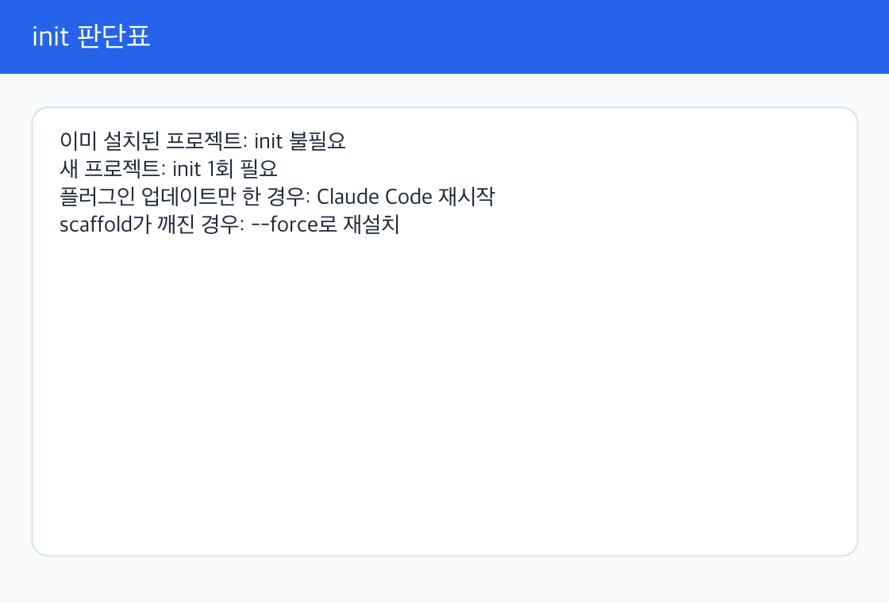
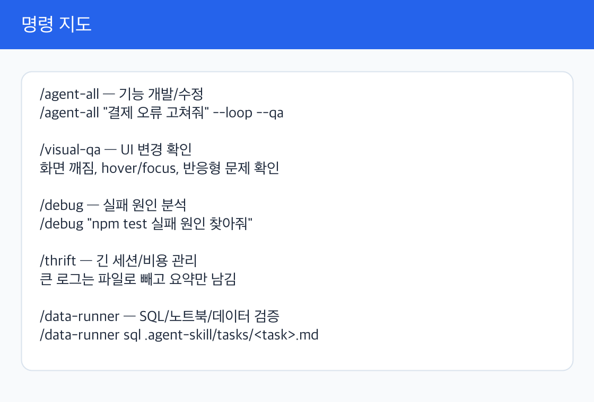
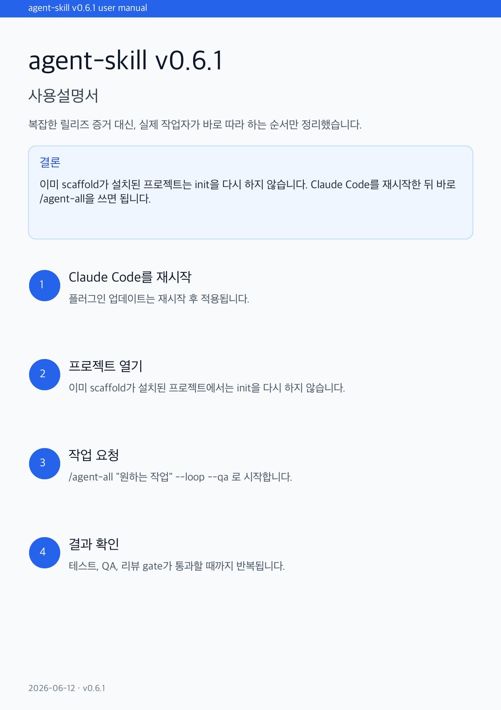
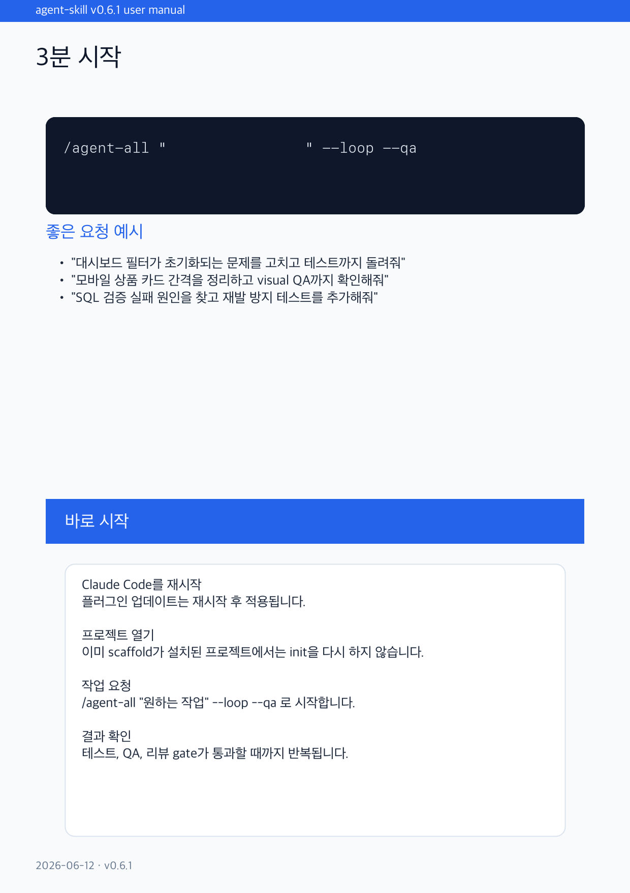
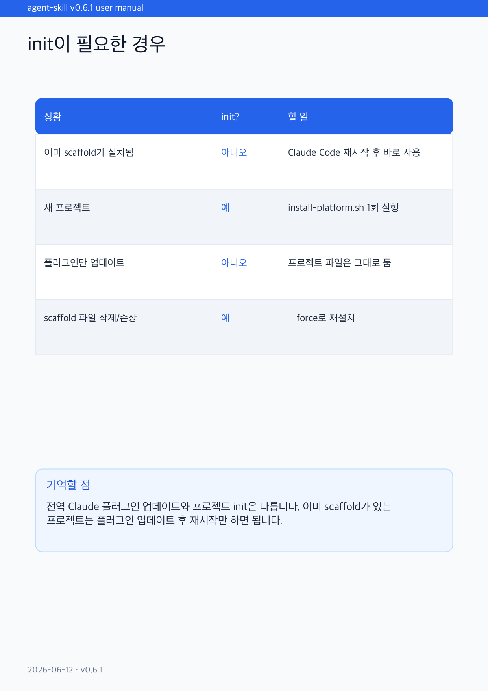
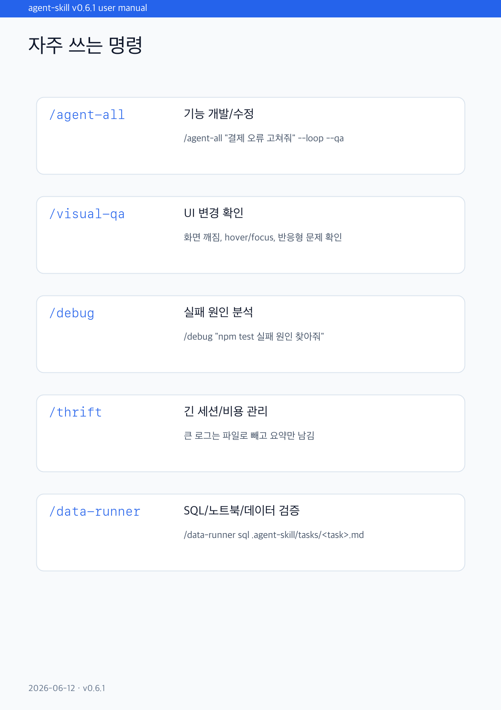
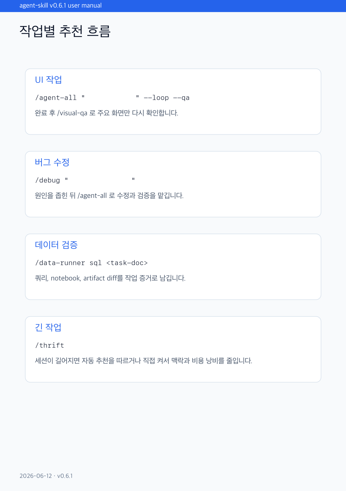
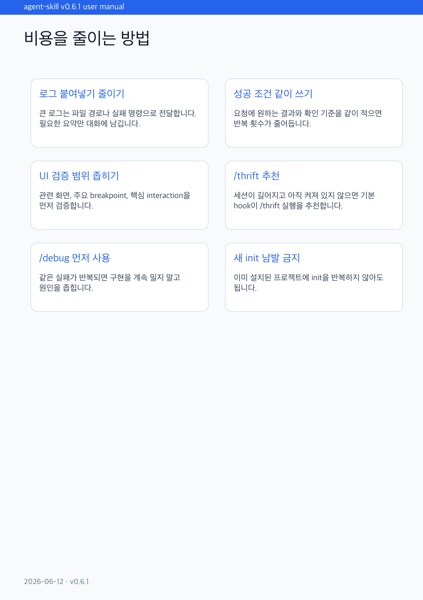
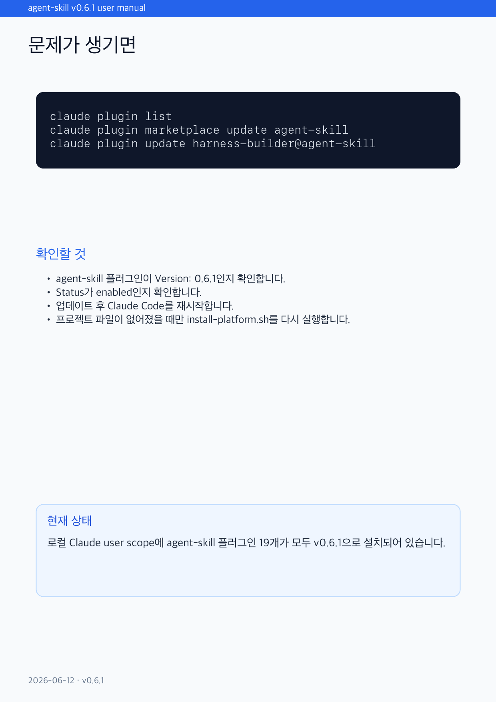

> English: [USER_MANUAL.md](USER_MANUAL.md)

# agent-skill 사용설명서

이 문서는 처음 쓰는 사람이 바로 따라 할 수 있게 만든 사용설명서입니다. 더 짧은 명령 레시피는 [USAGE.ko.md](USAGE.ko.md), 전체 기능 목록과 릴리즈 정책은 [README.ko.md](../README.ko.md)를 보세요.


## 먼저 알아야 할 것

`agent-skill`은 프로젝트 안에 에이전트 작업 흐름을 만들어 주는 도구입니다. 보통은 이렇게 씁니다.

1. 머신에 Claude Code 플러그인을 설치합니다.
2. Claude Code를 다시 시작하거나 `/reload-plugins`를 실행합니다.
3. 작업할 프로젝트에서 `/agent-init`을 한 번 실행합니다.
4. 이후에는 `/agent-all "하고 싶은 작업" --loop --qa`로 작업을 맡깁니다.

가장 중요한 구분은 **전역 플러그인 설치**와 **프로젝트 init**이 다르다는 점입니다.

| 구분 | 어디에 적용되나 | 언제 하나 | 확인 방법 |
|---|---|---|---|
| 전역 플러그인 설치 | 내 Claude Code 계정 또는 user scope | 머신당 한 번, 업데이트 때 다시 | `claude plugin list` 또는 Claude Code `/plugin list` |
| 프로젝트 init | 현재 git 저장소 | 프로젝트당 한 번 | `CLAUDE.md`, `.agent-all.json`, `.claude/agents/` 존재 |
| 일반 작업 실행 | 현재 프로젝트 | 기능, 버그, UI 작업마다 | `/agent-all "..." --loop --qa` |

전역 플러그인이 설치되어 있어도 새 프로젝트에는 아직 작업 규칙이 없습니다. 새 프로젝트에서는 `/agent-init`이 필요합니다. 이미 init된 프로젝트라면 다시 init하지 않고 바로 `/agent-all`을 사용합니다.



## 다른 하네스와의 관계

agent harness를 고르는 중이라면 [하네스 포지셔닝](HARNESS_POSITIONING.ko.md)을
먼저 보세요. 실무 기준으로는 이렇게 나눌 수 있습니다.

- Claude, Codex, Copilot, Cursor, Gemini, VS Code Copilot에 같은
  project-local scaffold를 깔고 싶으면 `agent-skill`
- tmux/worktree 실행 모델을 중심에 둔 external runner가 필요하면 Gajae-Code
- OpenCode-native orchestration, model routing, Team Mode, LSP/AST tooling,
  embedded MCP 안에서 살고 싶으면 OMO

`agent-skill`은 general harness blueprint로도 유용합니다. public command
contract, project scaffold, host adapter, policy layer, verification layer,
state layer, release layer를 분리해서 보여주기 때문입니다.

## 지금 바로 써도 되는지 판단하기

| 현재 상태 | 바로 `/agent-all` 사용? | 해야 할 일 |
|---|---:|---|
| Claude Code에 플러그인이 설치되어 있고, 프로젝트에 `.agent-all.json`이 있음 | 예 | Claude Code를 재시작한 뒤 바로 사용 |
| Claude Code 플러그인만 설치했고, 프로젝트는 새 저장소임 | 아니오 | 프로젝트에서 `/agent-init` 한 번 실행 |
| 기존 프로젝트에 `CLAUDE.md`는 있지만 `.agent-all.json`이 없음 | 보통 아니오 | `/agent-init --merge` 또는 `/agent-init` 실행 |
| 프로젝트 scaffold가 깨졌거나 일부 파일을 삭제함 | 아니오 | `/agent-init --resume`, 필요하면 `--force` |
| Codex, Cursor, Copilot, Gemini에서 쓰려 함 | 플랫폼별로 다름 | `scripts/install-platform.sh --platform=... --target=...` 실행 |

## Claude Code에서 3분 시작

처음 설치하는 머신이라면 Claude Code에서 마켓플레이스를 한 번 등록합니다.

```text
/plugin marketplace add https://github.com/kim-song-jun/agent-skill
```

터미널에서 권장 설치를 실행합니다.

```bash
git clone https://github.com/kim-song-jun/agent-skill /tmp/agent-skill
bash /tmp/agent-skill/scripts/install-all.sh --foundations
```

Claude Code를 재시작하거나 아래 명령을 실행합니다.

```text
/reload-plugins
```

작업할 프로젝트로 이동합니다.

```bash
cd /path/to/my-project
```

Claude Code에서 프로젝트를 처음 설정합니다.

```text
/agent-init --lang=ko
```

이후부터는 작업을 맡기면 됩니다.

```text
/agent-all "로그인 버튼을 누르면 대시보드로 이동하고, 실패하면 오류 문구를 보여주게 고쳐줘" --loop --qa
```

## 새 프로젝트에 설치하기

Claude Code 밖의 터미널에서도 같은 scaffold를 만들 수 있습니다.

```bash
git clone https://github.com/kim-song-jun/agent-skill /tmp/agent-skill
bash /tmp/agent-skill/scripts/install-platform.sh \
  --platform=claude \
  --target=/path/to/my-project \
  --lang=ko
```

Codex CLI 프로젝트라면 플랫폼만 바꿉니다.

```bash
bash /tmp/agent-skill/scripts/install-platform.sh \
  --platform=codex \
  --target=/path/to/my-project \
  --lang=ko
```

Cursor, Copilot CLI, Gemini CLI도 같은 방식입니다.

```bash
bash /tmp/agent-skill/scripts/install-platform.sh --platform=cursor --target=/path/to/my-project
bash /tmp/agent-skill/scripts/install-platform.sh --platform=copilot --target=/path/to/my-project
bash /tmp/agent-skill/scripts/install-platform.sh --platform=gemini --target=/path/to/my-project
```

VS Code Copilot은 editor instructions 전용입니다.

```bash
bash /tmp/agent-skill/scripts/install-platform.sh --platform=vscode-copilot --target=/path/to/my-project
```

## 자주 쓰는 명령



| 명령 | 한 줄 설명 | 많이 쓰는 예 |
|---|---|---|
| `/agent-init` | 현재 프로젝트에 작업 규칙과 에이전트 정의를 설치 | `/agent-init --lang=ko` |
| `/agent-all` | 기능 개발, 버그 수정, 테스트, 리뷰, PR 흐름 실행 | `/agent-all "검색 필터 버그 수정" --loop --qa` |
| `/visual-qa` | 화면 캡처, 반응형, 클릭 가능한 요소, UI 회귀 확인 | `/visual-qa` |
| `/thrift` | 긴 세션과 큰 출력을 요약해 비용과 context를 줄임 | `/thrift`, `/thrift audit` |
| `/explore` | 코드베이스 구조와 특정 심볼 위치를 빠르게 찾음 | `/explore where UserRepository` |
| `/debug` | 실패를 재현하고 원인을 좁힘 | `/debug "npm test가 로그인 테스트에서 실패"` |
| `/data-runner` | SQL, notebook, batch artifact 검증 흐름 안내 | `/data-runner sql .agent-skill/tasks/T-YYYYMMDD-001-report.md` |
| `/agent-handoff` | 긴 작업을 다른 세션으로 넘길 요약과 재개 프롬프트 생성 | `/agent-handoff .agent-skill/tasks/T-YYYYMMDD-001-login.md` |

## 좋은 요청을 쓰는 방법

`/agent-all`에는 작업 목표, 성공 기준, 확인해야 할 화면이나 명령을 같이 적으면 좋습니다.

좋은 예:

```text
/agent-all "상품 목록에서 검색어를 지우면 페이지 번호도 1로 돌아가게 고쳐줘. npm test를 통과시키고, 모바일 390px과 데스크톱 1440px에서 목록/필터 UI가 깨지지 않는지 확인해줘" --loop --qa
```

좋은 예:

```text
/agent-all "관리자 사용자 목록에 비활성 사용자 숨기기 토글을 추가해줘. API 응답 필드는 isActive이고, 기존 정렬과 pagination은 유지해야 해. 관련 테스트를 추가해줘" --loop --qa
```

부족한 예:

```text
/agent-all "대시보드 고쳐줘"
```

짧은 요청도 실행은 되지만, agent가 먼저 질문하거나 잘못 추측할 가능성이 커집니다.

## UI 작업 흐름

UI를 바꾸는 작업은 `--qa`를 붙이는 것을 권장합니다.

```text
/agent-all "결제 실패 모달의 문구와 버튼 배치를 개선해줘" --loop --qa
```

작업이 끝난 뒤 화면만 다시 보고 싶으면 `/visual-qa`를 실행합니다.

```text
/visual-qa
```

`/visual-qa`는 프로젝트 설정에 맞춰 페이지를 열고, 스크린샷과 UI 상태를 검토합니다. Claude Code에서는 hard gate로 쓰기 좋고, Codex/Cursor/Copilot/Gemini 포트는 각 플랫폼의 실행 표면에 맞춰 prompt-level 또는 helper 방식으로 동작합니다.

## 긴 세션과 `/thrift`

긴 로그, 큰 테스트 출력, 오래 이어진 대화가 쌓이면 세션이 비싸지고 느려집니다. 이때 `/thrift`를 씁니다.

```text
/thrift
/thrift audit
```

v0.6.1부터는 프로젝트에 `.thrift.json`이 없고 큰 출력이 반복되면 context-mode router가 `/thrift` 사용을 추천합니다. 이미 thrift scaffold가 있는 프로젝트에서는 설정된 임계값에 따라 `/thrift summarise`와 `/compact` 안내가 나옵니다.

이 흐름이 `/thrift` 자동 추천 경로입니다. 지금 thrift를 켜는 것이 도움이 된다고 알려주고, 실제 실행은 사용자가 `/thrift`를 입력할 때까지 기다립니다.

추천이 떠도 자동으로 위험한 변경을 하지는 않습니다. 사용자가 `/thrift`를 실행하면 요약과 audit 파일을 남기고, 다음 작업에 필요한 정보만 대화에 남기는 방식입니다.

비용을 줄이는 습관:

- 큰 로그를 채팅에 붙이지 말고 파일 경로나 실패 명령을 알려줍니다.
- 요청에 성공 기준을 같이 적습니다.
- UI 검증은 관련 화면을 같이 알려줍니다.
- 같은 실패가 반복되면 `/debug`로 원인을 먼저 좁힙니다.

## Agent 정의와 워크플로우

`/agent-init`은 프로젝트에 다음 성격의 파일을 만듭니다.

| 파일 | 역할 |
|---|---|
| `CLAUDE.md` | 이 프로젝트에서 agent가 지켜야 할 작업 규칙 |
| `AGENTS.md` | 다른 CLI와 공유하는 agent 안내 |
| `.claude/agents/*.md` | 구현자, 리뷰어, QA, 보안, 데이터 역할 정의 |
| `.claude/hooks/*.mjs` | 정책 확인, context 관리, session 요약 hook |
| `.agent-all.json` | `/agent-all` 반복, 예산, 성공 조건 |
| `.visual-qa.json` | UI 검증 대상과 모드 |
| `.thrift.json` | 세션 요약과 비용 관리 설정 |

`/agent-all`은 요청을 보고 필요한 역할을 고릅니다. 예를 들어 frontend 변경이면 frontend-dev, design-reviewer, qa-reviewer가 붙고, 인증이나 권한 변경이면 security-reviewer가 붙습니다. SQL, notebook, batch artifact가 있으면 data-reviewer와 verification adapter가 붙습니다.

완료 판단은 대화 감으로 하지 않습니다. 테스트 명령, verification adapter, visual QA verdict, reviewer 결과, policy hook 결과를 근거로 반복하거나 멈춥니다.

## 플랫폼별 실제 지원 범위

모든 플랫폼에 같은 파일을 억지로 복사하지 않습니다. 각 도구가 실제로 읽는 형식으로 scaffold를 만듭니다.

| 플랫폼 | 설치 명령 | 실행 방식 | 현재 강도 |
|---|---|---|---|
| Claude Code | `install-all.sh` 또는 `/plugin install` | `/agent-init`, `/agent-all`, `/visual-qa`, `/thrift` slash command | Hard |
| Codex CLI | `install-platform.sh --platform=codex` | `AGENTS.md`와 `.codex/skills/` 기반으로 `run /agent-all for ...` | Mixed, shell policy는 hook, floor는 sequential prompt-level |
| Cursor | `install-platform.sh --platform=cursor` | Cursor chat에서 설치된 agent/rules를 참조 | Soft |
| GitHub Copilot CLI | `install-platform.sh --platform=copilot` | Copilot instructions와 optional hook helper 참조 | Prompt-level, hook helper는 수동 검토 후 |
| VS Code Copilot | `install-platform.sh --platform=vscode-copilot` | `.github/copilot-instructions.md`를 Copilot Chat이 읽음 | Instructions-only |
| Gemini CLI | `install-platform.sh --platform=gemini` | `GEMINI.md`와 `.gemini/skills/` 참조 | Soft |

Claude Code와 Codex는 로컬 릴리즈 gate에서 가장 강하게 검증됩니다. Cursor, Copilot, Gemini, VS Code Copilot은 파일 생성과 renderer 계약은 자동 검증되지만, 각 host의 실시간 UX는 prompt-level 또는 수동 확인 영역이 남아 있습니다.

## 안전 규칙

`agent-skill`은 아래 원칙을 지키도록 설계되어 있습니다.

- 기존 `CLAUDE.md`, `AGENTS.md`, `GEMINI.md` 전체를 통째로 덮어쓰지 않습니다. sentinel 섹션만 추가하거나 교체합니다.
- `install-platform.sh`는 전역 CLI config 파일을 자동 패치하지 않습니다. Codex, Gemini 같은 전역 설정 snippet은 stdout에 출력하고 사용자가 직접 병합합니다.
- destructive SQL/data 작업은 `allowDestructive=true` 같은 명시 승인이 없으면 차단합니다.
- 반복 작업은 비용, 런타임, 반복 횟수, policy hook, 같은 실패 반복으로 멈출 수 있습니다.
- 테스트나 visual QA가 실패하면 완료로 주장하지 않도록 reviewer와 verification gate를 둡니다.

## 문제가 생겼을 때

플러그인 설치 상태를 봅니다.

```bash
claude plugin list
```

마켓플레이스 목록을 새로고침합니다.

```text
/plugin marketplace update agent-skill
```

이미 설치한 플러그인을 최신으로 갱신합니다.

```text
/plugin update --marketplace agent-skill
/reload-plugins
```

프로젝트 scaffold만 다시 검사합니다.

```bash
node /tmp/agent-skill/scripts/doctor.mjs --target=/path/to/my-project --platform=claude
```

Codex 프로젝트라면:

```bash
node /tmp/agent-skill/scripts/doctor.mjs --target=/path/to/my-project --platform=codex
```

프로젝트 파일을 다시 만들 필요가 있으면:

```text
/agent-init --resume
```

정말 다시 생성해야 할 때만:

```text
/agent-init --force
```

## 이미지 설명서

아래 이미지는 릴리즈 PDF에 들어간 7쪽짜리 이미지 설명서입니다. 저장소 안에서도 바로 볼 수 있게 `docs/assets/user-manual/pages/`에 포함되어 있습니다.















## 어디를 보면 되나

| 찾는 것 | 문서 |
|---|---|
| 처음 쓰는 전체 설명 | 이 문서 |
| 짧은 명령 레시피 | [USAGE.ko.md](USAGE.ko.md) |
| 전체 기능과 릴리즈 gate | [README.ko.md](../README.ko.md) |
| 영어 사용설명서 | [USER_MANUAL.md](USER_MANUAL.md) |
| v0.6.1 릴리즈 PDF | <https://github.com/kim-song-jun/agent-skill/releases/tag/v0.6.1> |
